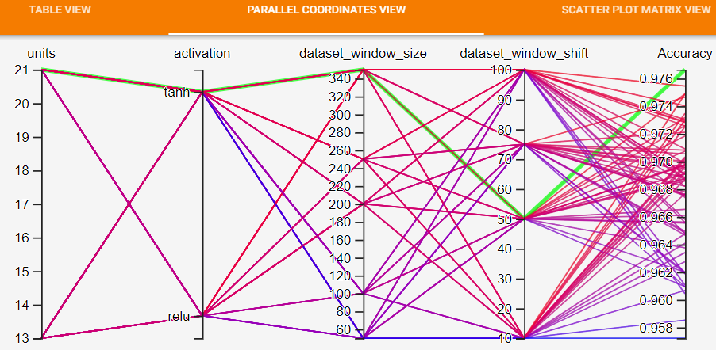
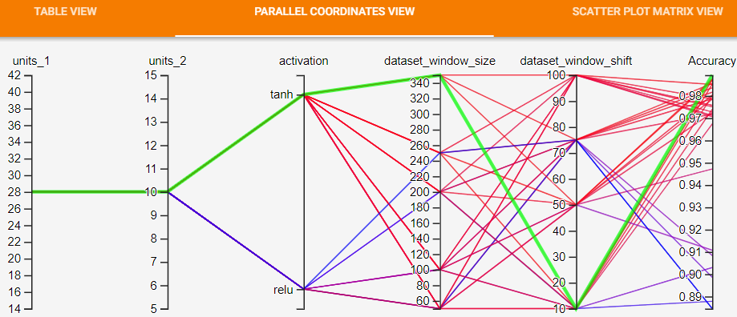

# Human_Activity_Recognition

# Info
This is the main branch

# How to run the code

Configure the config.gin file in /config:
1. Setup the dataset under 'Input pipeline'/'DataLoader':
    - 'dataset_name': Choose between 'hapt' and 'rw' for HAPT and RealWorld.
    - If RealWorld is chosen then 'sensor_position' can also be selected.
    - 'dataset_directory': The absolute path to a directory containing the dataset files.
    - 'tfrecords_directory': The absolute path to a directory which is the destination of the created dataset tfrecord files. Also is where the dataset files are loaded from in the future.   
    - 'create_tfrecords': This dis-/enables the dataset creation, True leads to the creation new tfrecords files, False skips the creation.
    - 'sequence_to_label': Select which classification method to use, sequence-to-label or sequence-to-sequence.

2. Setup the training under 'Train':
    There exists a basic and early-stopping section.

3. Setup the models under 'Main':
    Create models in 'models', examples and descriptions explain how.

Start by running: `python3 main.py` in the directory. Available flags are '--train'/'--notrain', '--eval'/'--noeval' and '--ensem'/'--noensem'. These flags select training, evaluation ensemble learning, the defaults are True/True/False.

# Results

This section captures some results for the project 'Human Activity Recognition'

## Baseline Evaluation
* Dataset - HAPT, Window Size - 250, Windown Shift - 125
* Optimizer - Adam, Learning Rate - 0.001, Epochs - 30k
* Batch - 32

| Model                             |  # of Parameters | Sequence to Label Accuracy | Sequence to Sequence Accuracy |
| :----:                            |       :----:     |              :----:        |          :----:               |
| simple_rnn-10-relu                |        313       |             **95.15%**     |          94.42%               |
| stack_rnn-10_10-relu              |        523       |             94.26%         |          94.28%               |
| stack_rnn-10_10_10-relu           |        733       |             94.19%         |          94.86%               |
| bidirectional_rnn-10-relu         |        613       |             No Run         |          **95.32%**           |
| simple_lstm-10-relu               |        823       |            **96.2%**       |          **95.12%**           |
| simple_lstm-10-10-relu            |        1663      |            92.27%          |          90.08%               |
| simple_lstm-10_10_10-relu         |        2503      |            88.34%          |          88.33%               |
| bidirectional_lstm-10-relu        |        1633      |            No Run          |          88.33%               |
| simple_gru-10-relu                |        683       |            97.68%          |          96.75%               |
| stack_gru-10_10-relu              |        1343      |           **98.37%**       |          96.51%               |
| stack_gru-10_10_10-relu           |        2003      |             97.59%         |          97.22%               |
| bidirectional_gru-10-relu         |        1353      |            No Run          |          **97.74%**           |

## Hyperparameter Evaluation

#### Sequence to Sequence
Evaluated on Simple GRU model on HAPT Dataset - 

Best Configuration for **Accuracy = 97.67\%** -
* Dataset Window Size - 350
* Dataset Window Shift Ratio - 50% of 350
* Units - 21
* Activation - tanh

#### Sequence to Label
Evaluated on 2 Layer Stacked LSTM model on HAPT Dataset -

Best Configuration for **Accuracy = 98.93\%** -
* Dataset Window Size - 350
* Dataset Window Shift Ratio - 10% of 350
* Units - 28 and 10
* Activation - tanh

## Ensemble Learning Evaluation

* HAPT Dataset
* Window Size - 250, Windown Shift - 125
* Level 0 models : Optimizer - Adam, Learning Rate - 0.001, Early stopping with metric 'Accuracy', patience 2000, delta 0.0001
* Ensemble model : Optimizer - Adam, Learning Rate - 0.001, Epoch 30k

|                       | simple_rnn-5-relu  |  simple_lstm-5-relu | simple_gru-5-relu | **Ensemble** |
|          :----:       |    :----:          |        :----:       |         :----:    |  :----:  |
| Sequence to Sequence  |    92.0%           |          93.2%      |        95.5%      | **96.4%**    |
| Sequence to Label     |    92.4%           |          95.8%      |        97.6%      | **97.9%**    |

|                       | simple_rnn-5-relu  |  simple_rnn-10-relu | simple_rnn-15-relu | **Ensemble** |
|          :----:       |    :----:          |        :----:       |         :----:     |  :----:  |
| Sequence to Sequence  |    93.8%           |          94.7%      |        94.9%       | **96.3%**    |
| Sequence to Label     |    93.1%           |          94.1%      |        94.7%       | **96.7%**    |

## Knowledge Distillation Evaluation

* HAPT Dataset
* Window Size - 250, Windown Shift - 125, Optimizer - Adam, Learning Rate - 0.001
* Teacher model simple_gru-50-relu : **Epoch 15k**
* Student model simple_rnn-5-relu  : **Epoch 1k**
* For Sequence to Sequence : Softmax Temperature - 10, 
  Alpha (for Soft Label DistillationLoss) - 0.8, Beta (for Hard Label Student Loss) - 0.2
* For Sequence to Label    : Softmax Temperature - 10, 
  Alpha (for Soft Label DistillationLoss) - 0.1, Beta (for Hard Label Student Loss) - 0.9
* **Parameter reduction = 9,363 to 138**  

|                       | Teacher Mode  |  Student Model from Scratch | Student Model |
|          :----:       |    :----:     |        :----:               |     :----:    |
| Sequence to Sequence  |    97.6%      |             90.4%           |      **91.0%**    |
| Sequence to Label     |    98.2%      |             95.8%           |      **90.3%**    |
